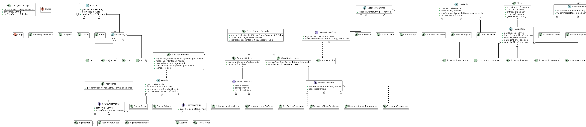

# Hamburgueria SmartBurguer

Sistema de gerenciamento completo de uma hamburgueria, cobrindo atendimento presencial, delivery, cozinha e administracao. O projeto aplica **todos os 23 padroes de projeto GoF** organizados em uma unica base de codigo coesa.

---

## Dominio

A SmartBurguer e uma hamburgueria moderna que opera tanto no balcao quanto via delivery. O sistema gerencia o ciclo completo de um pedido: montagem do lanche, escolha da forma de pagamento, envio para a cozinha, rastreamento do status, aplicacao de descontos e integracao com plataformas externas de entrega.

---

## Padroes aplicados

### Criacionais

| Padrao | Onde esta aplicado |
|---|---|
| **Singleton** | `ConfiguracaoLoja` — instancia unica das configuracoes globais da loja |
| **Factory Method** | `Atendente.prepararPagamento()` — cria a FormaPagamento correta a partir de um codigo |
| **Abstract Factory** | `Cardapio` + `CardapioTradicional` / `CardapioVegano` / `CardapioInfantil` — familias de lanche, bebida e acompanhamento |
| **Builder** | `MontagemPedido` — monta um Pedido passo a passo de forma fluente |
| **Prototype** | `PedidoRapido.clonar()` — repete um pedido salvo sem recriar tudo do zero |

### Estruturais

| Padrao | Onde esta aplicado |
|---|---|
| **Adapter** | `AdaptadorIFood` adapta `ApiIFood` (incompativel) para `PlataformaDeliveryExterno` |
| **Bridge** | `Pedido` (abstraction) x `FormaPagamento` (implementor) — qualquer combinacao sem heranca cruzada |
| **Composite** | `CategoriaMenu` (galho) + `ProdutoMenu` (folha) — cardapio com categorias aninhadas |
| **Decorator** | `Adicional` + `Bacon` / `QueijoExtra` / `Ovo` / `Catupiry` — adiciona ingredientes ao lanche dinamicamente |
| **Flyweight** | `TipoIngrediente` compartilhado via `FabricaIngredientes` — reduz objetos em simulacoes de estoque |
| **Proxy** | `SistemaAdminProxy` controla acesso ao `SistemaAdmin` com base no cargo do funcionario |
| **Facade** | `SmartBurguerFachada` — operacoes de alto nivel que orquestram todos os subsistemas |

### Comportamentais

| Padrao | Onde esta aplicado |
|---|---|
| **Chain of Responsibility** | `ValidadorEstoque` → `ValidadorPagamento` → `ValidadorHorario` — cadeia de validacao antes de confirmar pedido |
| **Command** | `AdicionarLancheNaFicha` / `RemoverLancheDaFicha` + `ControleOrdens` — operacoes reversiveis sobre pedidos |
| **Interpreter** | `CriterioNomeLanche` / `CriterioPrecoLanche` / `CriterioLancheE` / `CriterioLancheOU` — filtros compostos de lanches |
| **Iterator** | `IteradorColecaoMenu` percorre `ColecaoItensMenu` sem expor a lista interna |
| **Mediator** | `CentralPedidos` coordena `SetorBalcao`, `SetorCozinha` e `SetorEntrega` sem acoplamento direto |
| **Memento** | `SnapshotFicha` + `HistoricoFicha` — salva e restaura estados anteriores de uma ficha de cozinha |
| **Observer** | `Acompanhante` (`Cozinha`, `PainelCliente`) — notificados a cada mudanca de `Status` no `Pedido` |
| **State** | `FichaEstado` (abstrata) + 5 estados Singleton — ficha de cozinha delega transicoes ao estado atual |
| **Strategy** | `PoliticaDesconto` (`SemPoliticaDesconto`, `DescontoClubeFidelidade`, `DescontoCupomPromocional`, `DescontoProgressivo`) aplicadas na `CaixaRegistradora` |
| **Template Method** | `Lanche.imprimirFicha()` — esqueleto fixo; `getDescricao()` e `getPreco()` sao implementados pelas subclasses |
| **Visitor** | `CalculoNutricional` e `CalculoFiscal` percorrem `LancheCardapio`, `BebidaCardapio` e `SobremesaCardapio` |

---

## Diagrama de classes

---

122 testes passando.
